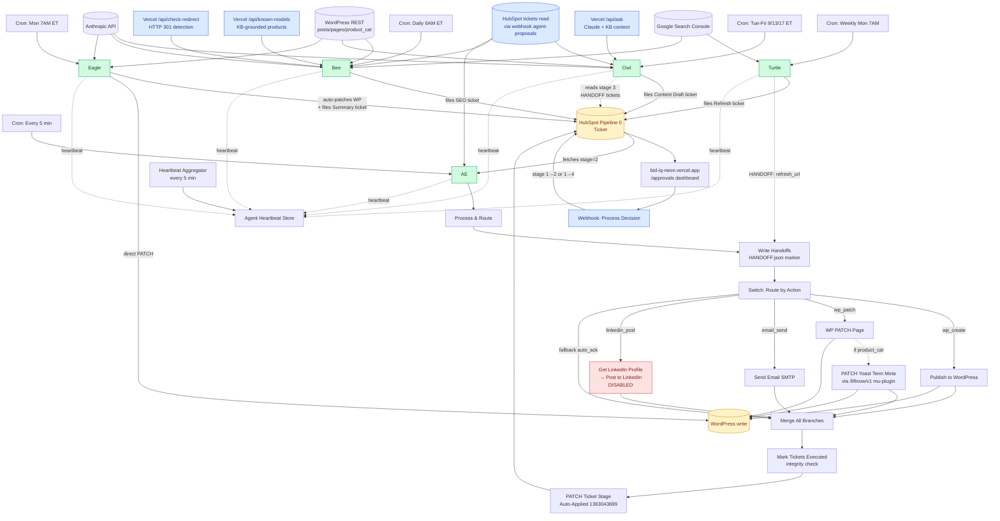

# Audit 02 — Dependency Graph

## Key dependencies & failure modes

| Edge | What flows | What fails if broken |
|---|---|---|
| Bee → /api/known-models | Real model list | Bee hallucinates models, QA gate catches but no ticket filed |
| Bee → /api/check-redirect | Redirect destination | Bee patches redirect-zombie posts (the previous bug) |
| Owl → HubSpot (Fetch Refresh Queue) | Turtle handoffs | Owl can't see Turtle's refresh requests. **CURRENTLY BROKEN — credential type mismatch.** |
| AE → WP PATCH Page | Title/meta/content writes | Tickets stuck in stage 2 forever (the id=0 bug, fixed) |
| AE → PATCH Yoast Term Meta | Yoast SEO fields | Category titles don't update visibly (Yoast template fallback hides it partially) |
| Mark Tickets Executed → integrity check | rest_* error detection | Tickets falsely Auto-Applied when WP rejects |

## Cycle / race risks

| Risk | Where | Current status |
|---|---|---|
| Bee + Eagle race on same page | If both fire same day and target same URL | UNGUARDED — Section 7 calls out `wp_resource_locks` table as P2 |
| Owl picks same Turtle handoff twice | Owl's refresh queue de-dupe | Uses staticData processedHandoffs (50-item cap) — fragile |
| AE re-processes already-Auto-Applied ticket | If integrity check fails to set stage | Possible — Auto-Applied stage `1363043699` filter on Fetch Approved Tickets ensures stage 2 only, so closed tickets aren't re-fetched |
| Buck-pass loop (A enriches → B rejects → A retries) | None currently | Owl Self-Reject doesn't re-queue; it just logs. Safe. |

## Vercel helpers are single points of failure for Bee

`/api/check-redirect` and `/api/known-models` are **uniquely necessary** for Bee:
- Without `/api/check-redirect`: Bee patches redirect-zombie posts (old bug pattern)
- Without `/api/known-models`: Bee hallucinates models (yesterday's bug)

Currently no active monitoring on either. Section 4 P1 calls this out.
